# Case #4 – Opensearch Hot-Warm Architecture

<div align="center">


</div>

<div align="center">


</div>

## Acknowledgments

First of all, thank you for your workshop. It was really interesting and I look forward to visit the next one. So, here
is my sollution of this case. Now, let's get started:

## Preparing

After forking and clonning the repository we need to run Docker containers and set up basic stuff in OpenSearch

According to the instruction run all the services from Dockercompose file and run securityadmin:

> [!tip]
> 1. Run docker-compose
> 2. Run securityadmin.sh when master will have message in log: **[opensearch-master] Not yet initialized (you may need
     to run securityadmin)**
>
> ```bash
> docker compose exec opensearch-master bash -c "chmod +x plugins/opensearch-security/tools/securityadmin.sh && bash plugins/opensearch-security/tools/securityadmin.sh -cd config/opensearch-security -icl -nhnv -cacert config/certs/root-ca.pem -cert config/certs/admin.pem -key config/certs/admin.key -h localhost"
> ```
>
> 3. Open OpenSearch Dashboards at <http://localhost:5601> and sign in with **admin** / **admin** (from the security config applied by `securityadmin`; `OPENSEARCH_INITIAL_ADMIN_PASSWORD` in compose mainly applies when demo config is installed).

### Index template, data stream и ISM (обязательно для чекпоинтов)

В репозитории изначально не было JSON шаблона индекса — только скриншоты UI. Для диплома удобнее воспроизвести через **Dev Tools** или `curl`:

1. **Шаблон data stream** (паттерн `logs*`, поле времени `timestamp`, 1 шард / 1 реплика, выделение на **hot**):

   `PUT _index_template/logs-template` с телом из файла [`index-template-logs.json`](index-template-logs.json).

2. **Data stream** `logs`:

   `PUT _data_stream/logs`

3. **Политика ISM** `hot_warm` (экспорт из UI см. [`hot_warm.json`](hot_warm.json); для создания через API используйте очищенное тело [`hot_warm-put.json`](hot_warm-put.json)):

   `PUT _plugins/_ism/policies/hot_warm`

**Важно:** для backing-индексов data stream (`logs`) имена вида `.ds-logs-2024.01.01-000001`, поэтому в `ism_template` политики нужен паттерн **`.ds-logs-*`**, а не только `logs*` — иначе политика не привяжется к индексам стрима.

Пример проверки из задания:

- `GET _cat/nodeattrs?v` — у data-нод должны быть атрибуты `temp: hot` и `temp: warm`.
- `GET _cat/shards?v` — шарды сначала на hot, после allocation — на warm, затем индекс удаляется.

securityadmin initializes the OpenSearch Security plugin for the cluster. Without this step the master node keeps
printing `Not yet initialized (you may need to run securityadmin)` and the cluster runs with a temporary default
security configuration

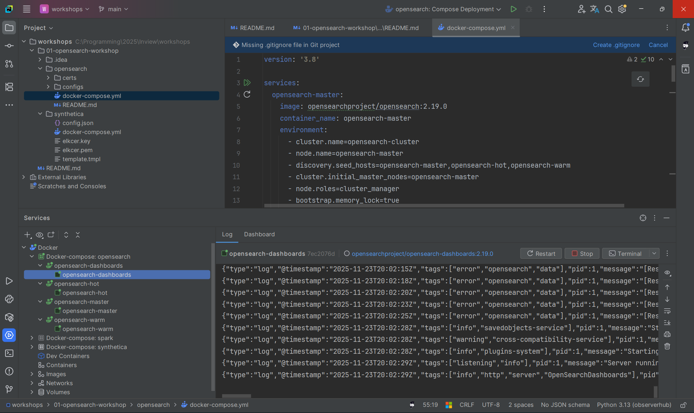
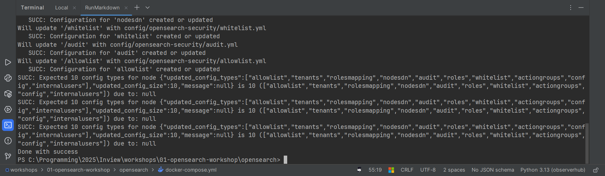


Now we can go to web interface and start working with OpenSearch UI

After logging with standard `admin` `admin` credentials

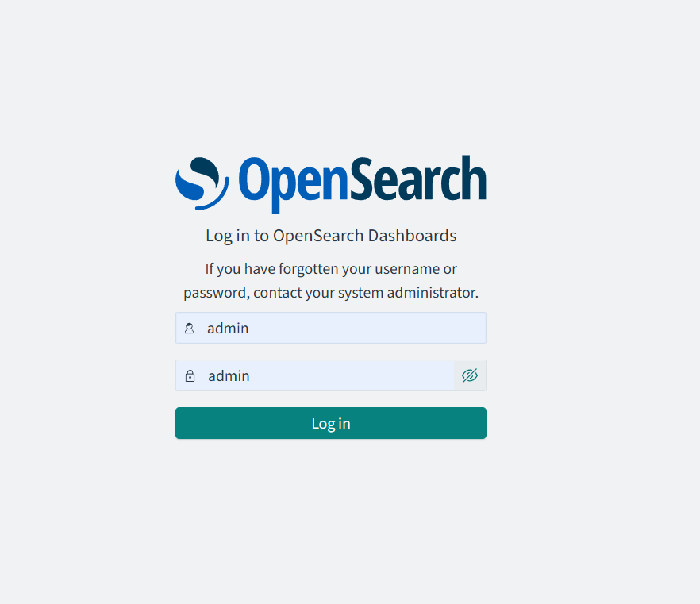

Go to `Management` -> `Index Management` and here we can see our State management policies, in our case:) this is
`hot_warm ` one

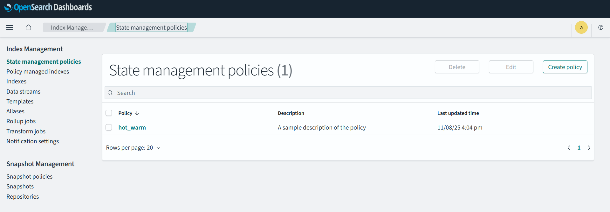

Clicking on it, we can manage whole workflow. There are 3 sections:

1. First
   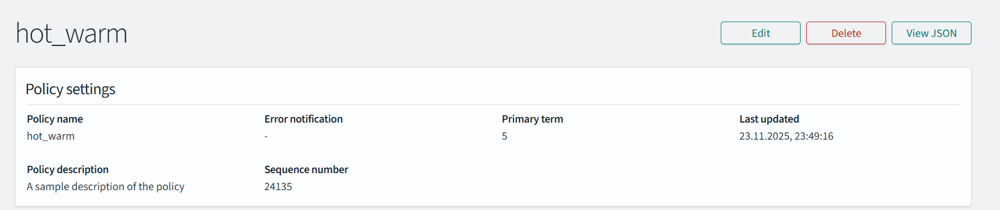
   In the first section we see the **Policy settings** for the `hot_warm` policy. This page shows the policy identifier,
   description, default state (`hot`), current schema or sequence numbers, last updated time and optional error
   notification settings


2. Second
   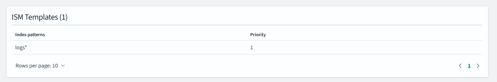
   The second section is **ISM templates**. Here we define which indexes or data streams will automatically use this
   policy. In my case the template contains an index pattern that matches `logs` indexes and a priority value, so every
   new backing index created for the `logs` data stream automatically gets the `hot_warm` policy attached


3. Third, main
   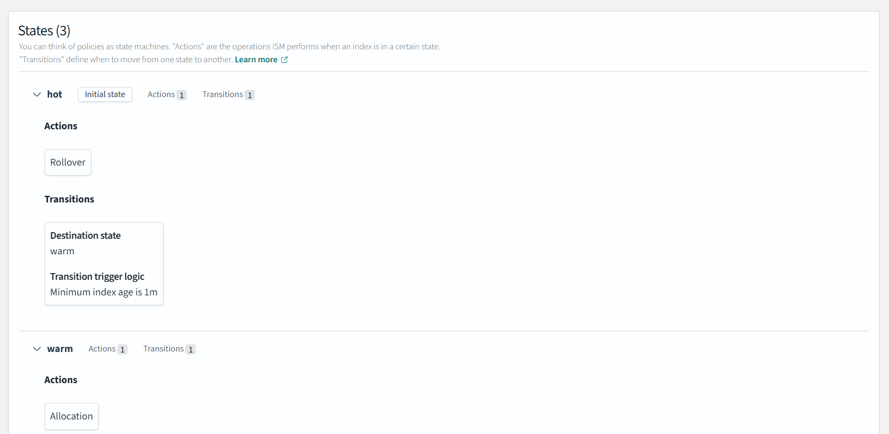
   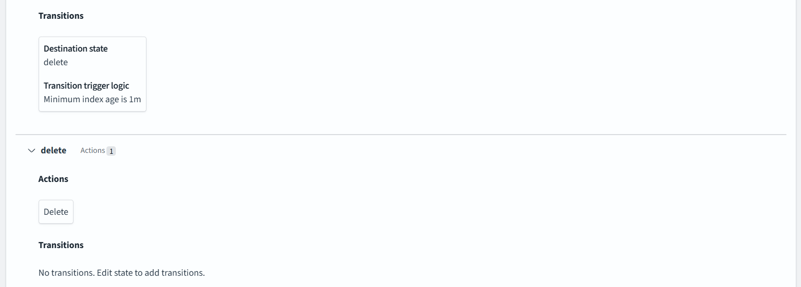
   The third, main section shows the **States** of the policy. It visualises the lifecycle of an index: it starts in the
   `hot` state, where a rollover action is triggered after the index reaches the configured age and size, then
   transitions to the `warm` state, and finally goes to the `delete` state, where the index is removed

Also, we can check out created Data stream `logs`
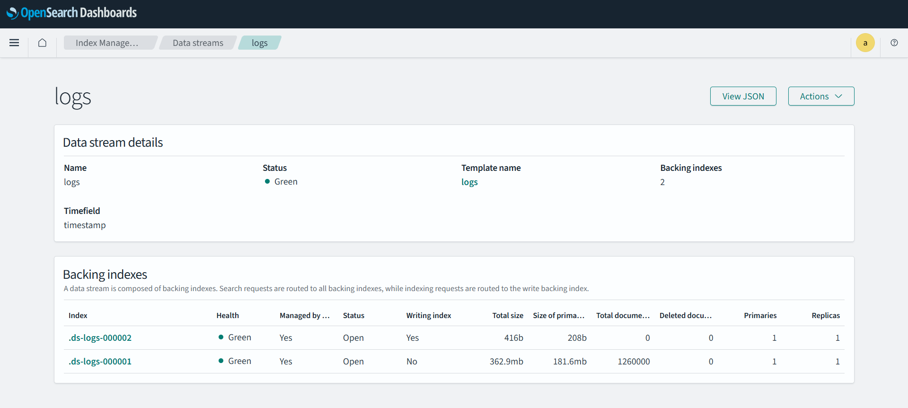

This is created template `logs`

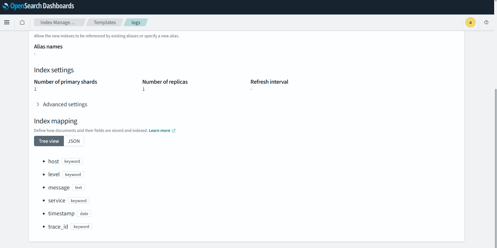

To be completely agreed with the given task in workshop, I created two extra containers with warm & hot nodes, so now we
have 5 of them:
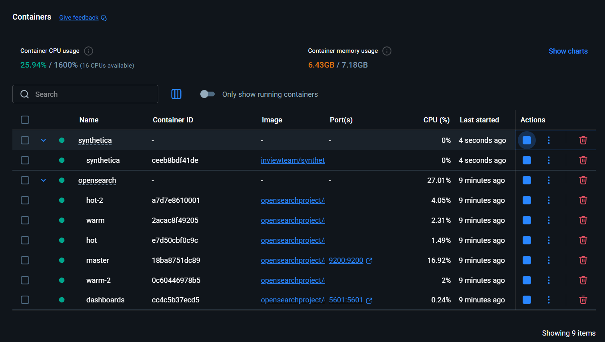

And finally we can see green indexes in `Indexes` page:

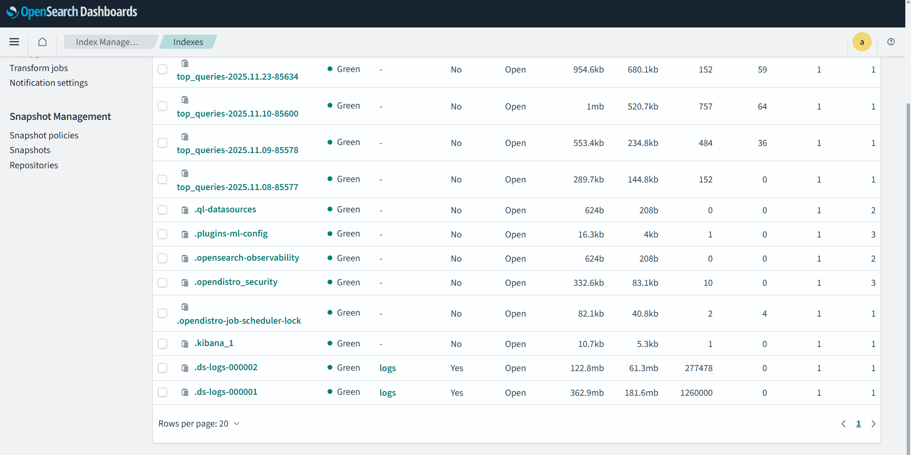